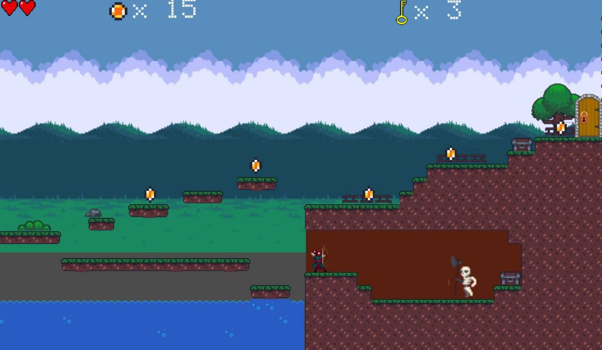
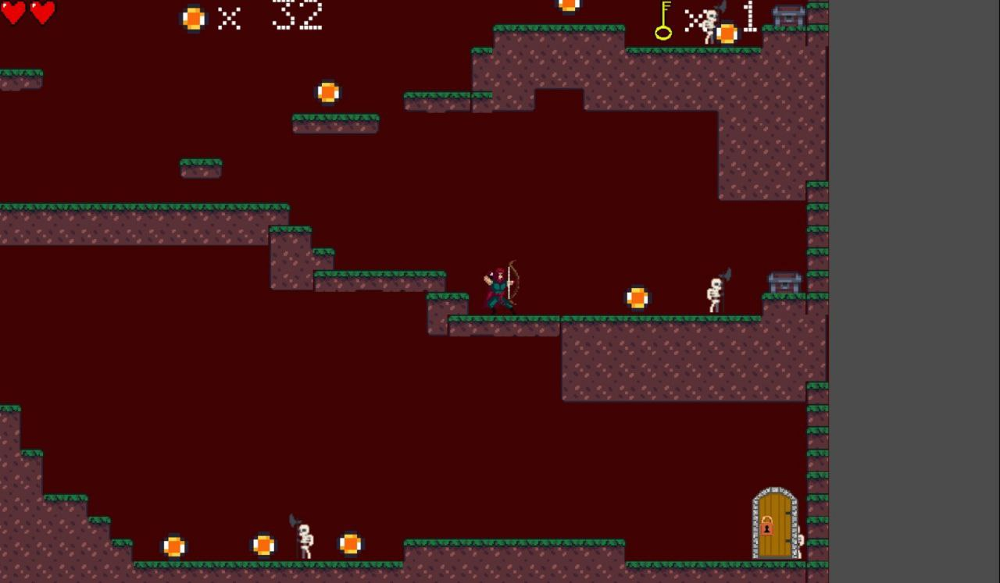

# 🏹 Archers Adventure

A 2D platformer game developed using **Godot 3.5**.

In the game the player controls an archer exploring dangerous levels filled with enemies, treasure chests and hidden paths.  
To complete a level the player must collect keys and unlock the exit door while surviving skeleton attacks.

---

## 🎮 Gameplay

The player controls an archer who explores the level and fights skeleton enemies.

### Objective

To finish a level the player must:

1. Collect a required number of **keys**
2. Use the keys to **unlock the exit door**

Keys can be found inside **treasure chests** scattered throughout the level.

However, the chests are often guarded by **skeleton enemies**, so the player must defeat them using the bow.

---

## 🎹 Controls

| Key | Action |
|----|----|
| ← → | Move |
| ↑ | Jump |
| Space (hold) | Shoot arrows |

---

## ❤️ Player Health

The player starts with **3 hearts**.

Damage sources:

- Skeleton attacks
- Falling outside the world

Each hit removes **one heart**.

If all hearts are lost, the player dies.

---

## 🪙 Coins

Coins are collectible items found across the level.

Currently they have **no gameplay function**, but future updates may introduce:

- character upgrades
- cosmetic customization
- additional gameplay mechanics

---

## 👾 Enemies

### Skeleton

Skeletons guard treasure chests and attack the player.

They can be defeated by shooting arrows.

---

## 📸 Screenshots

### Surface Level

### Cave Area

---

## 🛠 Built With

- **Godot Engine 3.5**
- **GDScript**
- **Git**
- **GitHub**

---

## ⚠ Known Issues

Some bugs are currently known and will be fixed in future updates:

- Skeleton attack range may sometimes trigger from too far away
- Skeletons can still deal damage during their death animation

---

## 🔧 Planned Improvements

Future updates may include:

- Fix skeleton attack range bug
- Prevent skeletons from attacking during death animation
- Minor visual and texture improvements
- Implement gameplay mechanics for coins
- Character upgrades or customization using coins
- **New levels**
- **New environments and level themes**

---

## 🚀 Running the Project

1. Install **Godot Engine 3.5**
2. Clone the repository
git clone https://github.com/vanitskiy18/godot-archers-adventure.git
3. Open the project in **Godot**
4. Run the main scene

---

## 📚 Learning Project

This project was created as a learning exercise to practice:

- game development in **Godot**
- **GDScript programming**
- working with **Git**
- managing projects on **GitHub**

---

## 📄 License

This project is intended for **educational purposes**.
